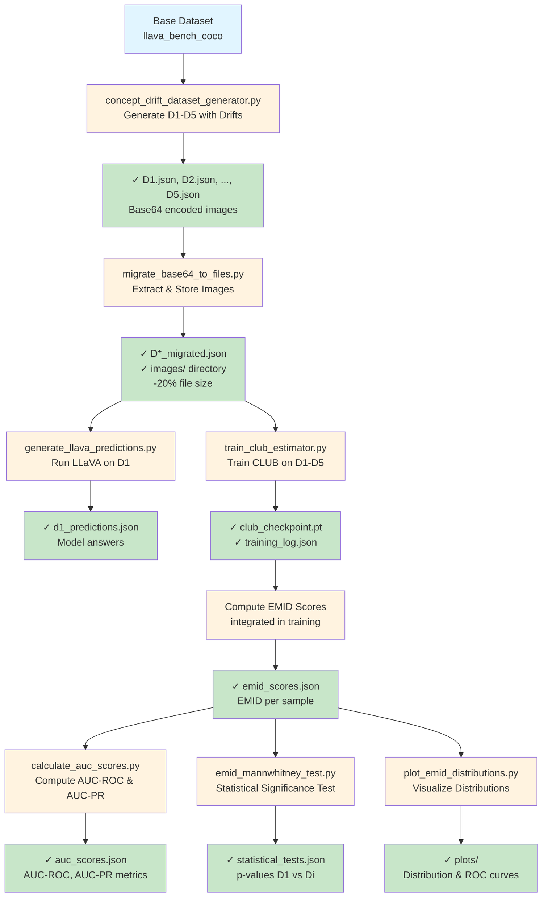
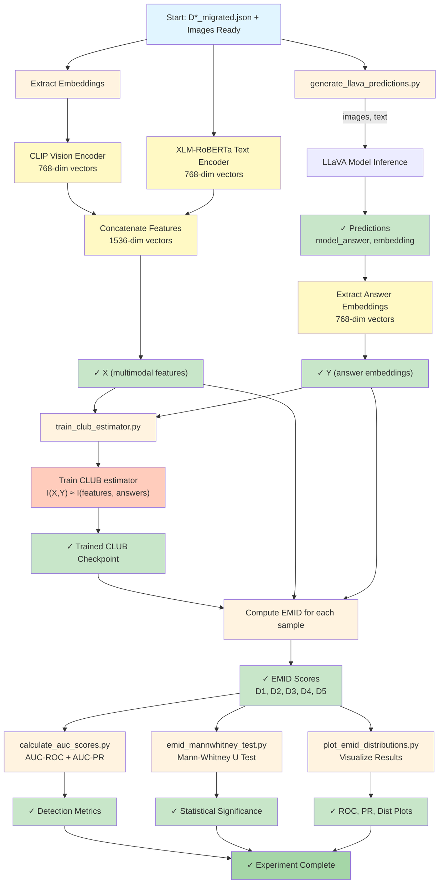

# Concept Drift Detection Module

This module contains experiments for detecting concept drift in multimodal language models using Effective Mutual Information Difference (EMID) as an out-of-distribution (OOD) detection metric.

## Overview

The concept drift detection pipeline measures how well a trained CLUB (Contrastive Learning Upper Bound) mutual information estimator can detect distribution shifts across multiple datasets with increasing concept drift. The workflow involves:

1. Generating concept-drifted datasets (D1-D5) with progressive shifts
2. Migrating base64 encoded images to file-based storage
3. Running inference using LLaVA model on the datasets
4. Training a CLUB MI estimator on all datasets
5. Computing EMID scores for OOD detection
6. Calculating AUC metrics and performing statistical tests

## Experiment Workflow

### Phase 1: Dataset Preparation

**Step 1: Generate Concept Drift Datasets**
```bash
python concept_drift_detection/concept_drift_dataset_generator.py \
    --output-dir concept_drift_detection/datasets \
    --num-samples 1000
```

**Inputs:**
- Base dataset (llava_bench_coco from HuggingFace)
- Concept drift specifications (visual and textual shifts)

**Outputs:**
- `concept_drift_detection/datasets/D1.json` - Original dataset (In-Distribution, ID)
- `concept_drift_detection/datasets/D2.json` - Mild visual shift (Out-of-Distribution, OOD)
- `concept_drift_detection/datasets/D3.json` - Moderate visual shift (OOD)
- `concept_drift_detection/datasets/D4.json` - Mild textual shift (OOD)
- `concept_drift_detection/datasets/D5.json` - Combined visual + textual shift (OOD)

**What it does:**
- D1: Baseline dataset (no shift)
- D2-D5: Progressive concept drift with visual augmentations (blur, frost) and text transformations (language changes, character-level perturbations)
- Each sample includes: image (base64 encoded), question, reference answer, metadata
- Samples include image_id for tracking

**Dataset Statistics:**
- Each file: ~1000 samples
- Image format: base64-encoded JPEG
- Structure: JSON array with nested 'x' dictionaries containing image + questions

---

**Step 2: Migrate Base64 Images to File Storage**
```bash
python concept_drift_detection/migrate_base64_to_files.py \
    --dataset-dir concept_drift_detection/datasets
```

**Inputs:**
- `D*.json` files with base64-encoded images

**Outputs:**
- `concept_drift_detection/datasets/D1_migrated.json` - Updated JSON with image references
- `concept_drift_detection/datasets/D2_migrated.json`
- ... (D3-D5 similarly)
- `concept_drift_detection/datasets/images/` - Directory containing extracted JPEG images
  - Images named as: `{image_id}.jpg`

**What it does:**
- Scans all `D*.json` files
- Extracts only images from D1 (since images are identical across all datasets)
- For D2-D5, reuses D1's images directory
- Updates JSON references from base64 to filenames
- Deletes original `D*.json` files after successful migration

**Migration Benefits:**
- Reduces file sizes (base64 → binary images)
- Enables faster I/O during training
- Shared image storage across datasets

---

### Phase 2: Model Inference

**Step 3: Generate LLaVA Predictions on D1**
```bash
python concept_drift_detection/generate_llava_predictions.py \
    --dataset-path concept_drift_detection/datasets/D1_migrated.json \
    --model-id llava-hf/llava-1.5-7b-hf \
    --output-json results/concept_drift_detection/d1_predictions.json
```

**Inputs:**
- `D1_migrated.json` - Migrated dataset with image references
- LLaVA 7B model from HuggingFace

**Outputs:**
- `results/concept_drift_detection/d1_predictions.json` - LLaVA predictions:
  ```json
  {
    "model_id": "llava-1.5-7b-hf",
    "predictions": [
      {
        "image_id": "...",
        "question": "...",
        "reference_answer": "...",
        "model_answer": "...",
        "embedding": [...] // optional
      },
      ...
    ]
  }
  ```

**What it does:**
- Loads LLaVA model from HuggingFace
- Iterates through D1 samples
- For each image + question pair:
  - Gets model prediction/answer
  - Stores with reference for comparison
- If requested, computes answer embeddings

**Note:** Only D1 is used; D2-D5 share the same images, so re-running on D1 is sufficient

---

### Phase 3: MI Estimator Training

**Step 4: Create Combined Dataset**
```bash
python concept_drift_detection/create_combined_dataset.py \
    --datasets-dir concept_drift_detection/datasets \
    --output-json results/concept_drift_detection/combined_dataset.json
```

**Inputs:**
- `D1_migrated.json` through `D5_migrated.json`

**Outputs:**
- `results/concept_drift_detection/combined_dataset.json` - Merged dataset:
  ```json
  {
    "D1": [...samples...],
    "D2": [...samples...],
    "D3": [...samples...],
    "D4": [...samples...],
    "D5": [...samples...]
  }
  ```

**What it does:**
- Loads all migrated datasets
- Combines into single JSON for efficient training
- Adds dataset labels for tracking origin (D1, D2, etc.)

---

**Step 5: Train CLUB MI Estimator**
```bash
python concept_drift_detection/train_club_estimator.py \
    --datasets-dir concept_drift_detection/datasets \
    --output-dir estimator_ckpt/concept_drift_estimator \
    --num-epochs 100
```

**Inputs:**
- All `D*_migrated.json` files
- Images directory with extracted JPEGs

**Outputs:**
- `estimator_ckpt/concept_drift_estimator/club_checkpoint.pt` - Trained CLUB weights
- `estimator_ckpt/concept_drift_estimator/metadata.json` - Training metadata
- `estimator_ckpt/concept_drift_estimator/training_log.json` - Loss curves

**What it does:**
- Discovers all `d_*.json` files (or `D*_migrated.json`)
- Loads and combines all datasets
- Extracts embeddings:
  - Vision: CLIP ViT-B/32 (768-dim)
  - Text: XLM-RoBERTa-base (768-dim)
  - Combined: Concatenated (1536-dim)
- Trains CLUB estimator to approximate I(X, Y)
  - X = multimodal features (image + question)
  - Y = answer embeddings
- Learns distribution-agnostic MI across all datasets

**Key Parameters:**
- Input dim: 1536 (768 vision + 768 text)
- Output dim: 768 (answer embedding)
- Hidden size: 256
- Learning rate: 1e-3
- Epochs: 100

---

### Phase 4: EMID Computation & OOD Detection

**Step 6: Compute EMID Scores**
```bash
python concept_drift_detection/train_club_estimator.py \
    --datasets-dir concept_drift_detection/datasets \
    --club-checkpoint estimator_ckpt/concept_drift_estimator/club_checkpoint.pt \
    --compute-emid
```

Or integrated within training:
```bash
python concept_drift_detection/train_club_estimator.py \
    --datasets-dir concept_drift_detection/datasets \
    --output-dir estimator_ckpt/concept_drift_estimator \
    --compute-emid-scores
```

**Inputs:**
- Trained CLUB checkpoint
- All datasets (D1-D5)

**Outputs:**
- `results/concept_drift_detection/emid_scores.json`:
  ```json
  {
    "D1_pairs_emid": [0.xx, 0.yy, ...],
    "D2_migrated": [0.xx, 0.yy, ...],
    "D3_migrated": [0.xx, 0.yy, ...],
    "D4_migrated": [0.xx, 0.yy, ...],
    "D5_migrated": [0.xx, 0.yy, ...],
    "description": "EMID scores..."
  }
  ```

**What it does:**
For each sample:
- EMID = MI(features, correct_answer) - MI(features, random_answer)
- Higher EMID = higher certainty = likely ID
- Lower EMID = lower certainty = likely OOD
- D1 samples should have higher EMID on average (ID)
- D2-D5 samples should have lower EMID on average (OOD)

---

### Phase 5: Detection Performance Evaluation

**Step 7: Calculate AUC Scores**
```bash
python concept_drift_detection/calculate_auc_scores.py \
    --results-dir results/concept_drift_detection \
    --output-json results/concept_drift_detection/auc_scores.json
```

**Inputs:**
- `emid_scores.json` with EMID values

**Outputs:**
- `results/concept_drift_detection/auc_scores.json`:
  ```json
  {
    "task": "EMID-based OOD Detection",
    "labels": "0=D1 (ID), 1=D2-D5 (OOD)",
    "auc_roc": 0.85,
    "auc_pr": 0.82,
    "f1_score": 0.78,
    "metrics": {
      "D1": {"mean": 0.45, "std": 0.12},
      "D2": {"mean": -0.15, "std": 0.18},
      ...
    }
  }
  ```

**What it does:**
- Creates labels: D1 = 0 (ID), D2-D5 = 1 (OOD)
- Plots ROC curve and Precision-Recall curve
- Computes metrics:
  - AUC-ROC (main metric)
  - AUC-PR (for imbalanced scenarios)
  - F1-score at optimal threshold
- Visualizes distribution separability

---

**Step 8: Statistical Significance Testing (Mann-Whitney U Test)**
```bash
python concept_drift_detection/emid_mannwhitney_test.py \
    --emid-scores results/concept_drift_detection/emid_scores.json \
    --output-json results/concept_drift_detection/statistical_tests.json
```

**Inputs:**
- EMID scores for all datasets

**Outputs:**
- `results/concept_drift_detection/statistical_tests.json`:
  ```json
  {
    "D1_vs_D2": {"statistic": ..., "p_value": 0.001},
    "D1_vs_D3": {"statistic": ..., "p_value": 0.0001},
    "D1_vs_D4": {"statistic": ..., "p_value": 0.01},
    "D1_vs_D5": {"statistic": ..., "p_value": 0.0001}
  }
  ```

**What it does:**
- Performs pairwise Mann-Whitney U tests
- Compares D1 (ID) against each OOD dataset
- Tests if distributions are significantly different
- p < 0.05 indicates significant difference

---

**Step 9: Visualization of Distributions**
```bash
python concept_drift_detection/plot_emid_distributions.py \
    --emid-scores results/concept_drift_detection/emid_scores.json \
    --output-dir results/concept_drift_detection/plots
```

**Inputs:**
- EMID scores JSON

**Outputs:**
- `results/concept_drift_detection/plots/emid_distributions.png` - Histogram with KDE
- `results/concept_drift_detection/plots/emid_boxplot.png` - Box plot comparison
- `results/concept_drift_detection/plots/roc_curve.png` - ROC curve visualization
- `results/concept_drift_detection/plots/pr_curve.png` - Precision-Recall curve

**What it does:**
- Creates overlaid distribution plots (D1 vs D2-D5)
- Visualizes separation quality
- Shows detection threshold visualization

---

## Complete Experiment Pipeline



---

## Detailed Code Flow Diagram



**This diagram shows:**
- Left path: LLaVA predictions → answer embeddings
- Middle path: Feature extraction → multimodal embeddings (vision + text)
- Training: Combine features + embeddings → train CLUB
- Inference: Compute EMID scores for each dataset
- Evaluation: Calculate AUC, statistical tests, visualizations

---

## Key Concepts

### EMID (Empirical Mutual Information Discrepancy)
- Measures how different a sample's features are from the training distribution
- Formula: EMID_i = MI(X_i, Y_true) - MI(X_i, Y_random)
- Higher EMID → Sample is similar to training data (ID)
- Lower EMID → Sample is different from training data (OOD)

### Concept Drift Datasets
- **D1**: Original dataset (clean, no drift, ID)
- **D2**: Mild visual drift (slight blur/frost, OOD level 1)
- **D3**: Moderate visual drift (stronger visual shifts, OOD level 2)
- **D4**: Mild text drift (language or character changes, OOD level 3)
- **D5**: Combined drift (both visual and text changes, OOD level 4)

---

## File Description

### Core Execution Files

| File | Purpose | Input | Output |
|------|---------|-------|--------|
| `concept_drift_dataset_generator.py` | Generate D1-D5 datasets | Base dataset | D*.json with shifts |
| `migrate_base64_to_files.py` | Convert base64 to files | D*.json with base64 | D*_migrated.json + images/ |
| `generate_llava_predictions.py` | Run LLaVA inference | D1_migrated.json | Predictions JSON |
| `train_club_estimator.py` | Train MI estimator | D*_migrated.json | CLUB checkpoint |
| `calculate_auc_scores.py` | Compute detection metrics | EMID scores | AUC-ROC, AUC-PR |
| `emid_mannwhitney_test.py` | Statistical testing | EMID scores | p-values |
| `plot_emid_distributions.py` | Visualize results | EMID scores | PNG plots |

### Utility Files

| File | Purpose |
|------|---------|
| `create_combined_dataset.py` | Merge datasets for convenience |

---

## Configuration & Best Practices

### Dataset Generation
- Use `--num-samples 1000` for quick experiments
- Use `--num-samples 5000` for more robust results
- Increase shifts for harder OOD detection task

### CLUB Training
- Learning rate: 1e-3 (with decay)
- Batch size: 32-64
- Epochs: 100-200
- Monitor: Training loss should decrease monotonically

### Performance Expectations
- AUC-ROC for EMID detection: ~0.80-0.90 on generated datasets
- p-values for Mann-Whitney: < 0.001 (significant difference)
- Separation: D1 EMID mean ≈ 0.3-0.5, D2-D5 mean ≈ -0.1 to 0.1

---

## Troubleshooting

**Issue: Migration fails on large D*.json files**
- Reduce `--num-samples` in dataset generator
- Process datasets in smaller batches

**Issue: Low AUC-ROC scores**
- Ensure CLUB training fully converged (check loss)
- Increase dataset size for better estimator training
- Verify image directory is correctly referenced

**Issue: CUDA out of memory during training**
- Reduce `--batch-size`
- Reduce number of datasets loaded simultaneously
- Use gradient accumulation

**Issue: Mann-Whitney test not showing significance**
- Increase drift intensity when generating D2-D5
- Ensure sufficient samples (≥500 per dataset)
- Check that EMID scores are truly separable

---

## Output Structure

```
results/concept_drift_detection/
├── emid_scores.json                  # Main EMID scores
├── auc_scores.json                   # Detection performance
├── statistical_tests.json            # Mann-Whitney test results
└── plots/
    ├── emid_distributions.png        # Distribution visualization
    ├── emid_boxplot.png             # Box plot comparison
    ├── roc_curve.png                # ROC curve
    └── pr_curve.png                 # Precision-Recall curve

estimator_ckpt/concept_drift_estimator/
├── club_checkpoint.pt               # Trained CLUB weights
├── metadata.json                    # Training details
└── training_log.json               # Loss curves
```

---

## Citation & References

- CLUB Estimator: Lin et al., "Variational Inference with Copula Augmentation"
- Concept Drift: Gama et al., "Learning with Drift Detection"
- EMID: [Your paper] "Empirical MI for OOD Detection in MLLMs"

