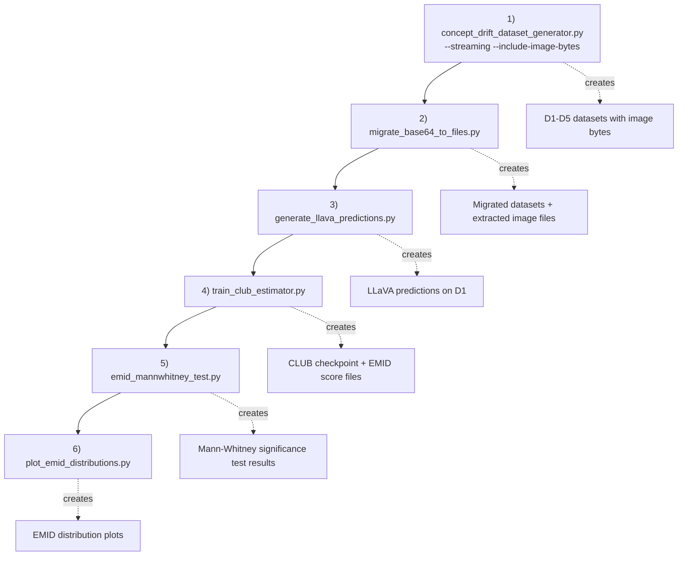

# Concept Drift Detection: Reproducibility Guide

This guide describes the exact command order required to reproduce the concept-drift experiments from the scripts in this folder.

## Execution Order (Run Exactly in Sequence)

Activate environment first:

```bash
conda activate mllmshift-emi
```

Then run:

```bash
python concept_drift_detection/concept_drift_dataset_generator.py --streaming --include-image-bytes
python concept_drift_detection/migrate_base64_to_files.py
python concept_drift_detection/generate_llava_predictions.py
python concept_drift_detection/train_club_estimator.py
python concept_drift_detection/emid_mannwhitney_test.py
python concept_drift_detection/plot_emid_distributions.py
```

## Pipeline Flowchart



## Codeflow (What Each Step Depends On)

1. **Dataset generation**
   - Script: `concept_drift_dataset_generator.py`
   - Produces D1-D5 concept-drift datasets.
   - This is the starting point for all later steps.

2. **Image migration**
   - Script: `migrate_base64_to_files.py`
   - Converts embedded/base64 images into file-based references.
   - Required before model inference for reliable image loading.

3. **LLaVA inference**
   - Script: `generate_llava_predictions.py`
   - Loads LLaVA and generates answers (primarily for D1 baseline).
   - Outputs prediction artifacts used by downstream MI/EMID analysis.

4. **CLUB training + EMID computation**
   - Script: `train_club_estimator.py`
   - Trains the mutual-information estimator and computes EMID scores for D1-D5.
   - Produces the primary quantitative outputs used in statistical testing and plotting.

5. **Significance testing**
   - Script: `emid_mannwhitney_test.py`
   - Runs Mann-Whitney U tests on EMID distributions to quantify drift significance.

6. **Visualization**
   - Script: `plot_emid_distributions.py`
   - Plots EMID distributions across datasets (KDE/mean summaries when available).
   - Final step for report-ready visual results.

## Why This Order Matters

- Step 2 requires outputs from Step 1.
- Step 3 requires migrated image references from Step 2.
- Step 4 relies on generated predictions and prepared datasets.
- Steps 5 and 6 consume EMID outputs from Step 4.

Running out of order can produce missing-file errors or incomplete analysis artifacts.

## Notes

- Run from repository root:
  - `.../mllmshift-emi`
- If model download/tokenizer issues appear in Step 3, ensure you are using the `mllmshift-emi` environment and rerun.
