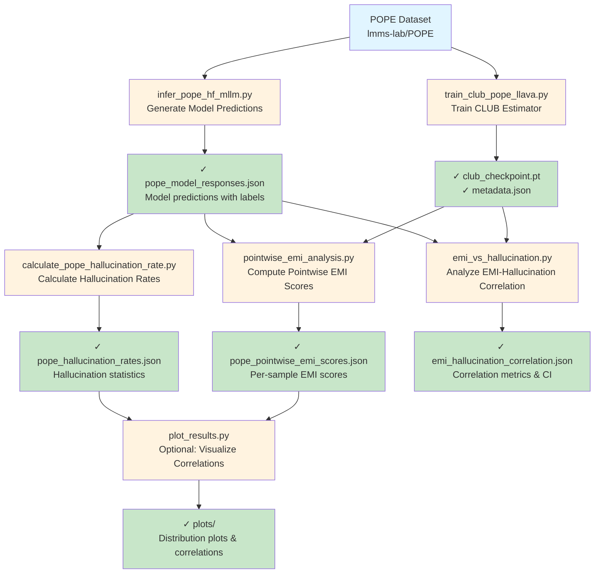

# Hallucination Detection Module

This module contains experiments for detecting hallucinations in multimodal language models using Empirical Mutual Information (EMI) estimation.

## Overview

The hallucination detection pipeline measures how well a trained CLUB (Contrastive Learning Upper Bound) mutual information estimator can predict hallucination rates in language models. The workflow involves:

1. Training a CLUB MI estimator on the POPE dataset
2. Running inference on the POPE dataset using LLaVA models
3. Computing hallucination rates from model predictions
4. Analyzing correlations between EMI scores and hallucination rates

## Experiment Workflow

### Phase 1: Data Preparation & Model Training

**Step 1: Train CLUB Estimator on POPE Dataset**
```bash
python hallucination_detection/train_club_pope_llava.py \
    --output-dir estimator_ckpt/pope_estimator
```

**Inputs:**
- POPE dataset from HuggingFace (`lmms-lab/POPE`)
- llava_bench_coco_English split (optional, for additional training)

**Outputs:**
- `estimator_ckpt/pope_estimator/club_checkpoint.pt` - Trained CLUB model weights
- `estimator_ckpt/pope_estimator/metadata.json` - Training metadata

**What it does:**
- Loads the full POPE dataset (all categories: adversarial, popular, random)
- Extracts embeddings using CLIP vision encoder and XLM-RoBERTa text encoder
- Trains a CLUB neural MI estimator to approximate I(X, Y)
- X = multimodal features (image + question embeddings)
- Y = reference answer embeddings

---

### Phase 2: Model Inference

**Step 2: Run Inference on POPE Dataset**
```bash
python hallucination_detection/infer_pope_hf_mllm.py \
    --model llava-hf/llava-1.5-7b-hf \
    --output-json results/pope_model_responses.json
```

**Inputs:**
- Pretrained LLaVA model from HuggingFace
- POPE dataset with images and questions

**Outputs:**
- `results/pope_model_responses.json` - Model predictions formatted as:
  ```json
  {
    "model_id": "llava-1.5-7b-hf",
    "categories": {
      "adversarial": [{"reference_answer": "...", "model_answer": "...", ...}, ...],
      "popular": [...],
      "random": [...]
    }
  }
  ```

**What it does:**
- Loads the trained LLaVA model
- Iterates through POPE dataset samples
- Gets yes/no predictions from the model
- Stores predictions with metadata (qid, question, references, category, split)

---

### Phase 3: Hallucination Rate Calculation

**Step 3: Calculate Hallucination Rates**
```bash
python hallucination_detection/calculate_pope_hallucination_rate.py \
    --input-json results/pope_model_responses.json \
    --output-json results/pope_hallucination_rates.json
```

**Inputs:**
- `pope_model_responses.json` - Model predictions from Step 2

**Outputs:**
- `results/pope_hallucination_rates.json` - Hallucination statistics:
  ```json
  {
    "model_id": "...",
    "categories": {
      "adversarial": {"hallucination_rate": 0.XX, "total": NNN, ...},
      "popular": {...},
      "random": {...}
    },
    "overall_hallucination_rate": 0.XX
  }
  ```

**What it does:**
- Parses model predictions
- Normalizes yes/no responses
- Compares model answers against reference answers
- Computes hallucination rates per category
- Hallucination = model says "yes" but reference says "no"

---

### Phase 4: EMI vs Hallucination Analysis

**Step 4: Compute Pointwise EMI Scores**
```bash
python hallucination_detection/pointwise_emi_analysis.py \
    --pope-json results/pope_model_responses.json \
    --club-checkpoint estimator_ckpt/pope_estimator/club_checkpoint.pt \
    --output-json results/pope_pointwise_emi_scores.json
```

**Inputs:**
- Trained CLUB checkpoint from Step 1
- Model predictions from Step 2

**Outputs:**
- `results/pope_pointwise_emi_scores.json` - Per-sample EMI scores

**What it does:**
- Loads the trained CLUB estimator
- For each sample, computes:
  - EMI_correct = MI(features, true_answer) - MI(features, model_answer)
  - EMI_true = MI(features, true_answer)
  - EMI_model = MI(features, model_answer)
- Stores pointwise scores for correlation analysis

---

**Step 5: Analyze EMI vs Hallucination Correlation**
```bash
python hallucination_detection/emi_vs_hallucination.py \
    --pope-json results/pope_model_responses.json \
    --club-checkpoint estimator_ckpt/pope_estimator/club_checkpoint.pt \
    --output-json results/emi_hallucination_correlation.json
```

**Inputs:**
- Trained CLUB checkpoint
- Model predictions with true labels

**Outputs:**
- `results/emi_hallucination_correlation.json` - Correlation statistics:
  ```json
  {
    "pearson_r": 0.XX,
    "pearson_p_value": 0.XXX,
    "spearman_rho": 0.XX,
    "spearman_p_value": 0.XXX,
    "ci_lower": 0.XX,
    "ci_upper": 0.XX
  }
  ```

**What it does:**
- Computes pointwise EMI scores for all samples
- Computes hallucination labels (1 = hallucination, 0 = correct)
- Computes Pearson and Spearman correlations
- Compute bootstrap confidence intervals
- Tests statistical significance

---

### Phase 5: Additional Analysis

**Step 6: Analyze EMID vs Hallucination Rate (Optional)**
```bash
python hallucination_detection/emid_vs_hallucination_rate.py \
    --pope-json results/pope_model_responses.json \
    --club-checkpoint estimator_ckpt/pope_estimator/club_checkpoint.pt \
    --output-json results/emid_hallucination_analysis.json
```

**What it does:**
- Groups samples by EMID (EMI Discrepancy) bins
- Computes hallucination rates per bin
- Analyzes how EMID at population level correlates with hallucination rates

---

## Complete Experiment Pipeline



---

## Key Dependencies

```python
# Core ML/DL
torch
transformers
datasets
PIL

# Scientific
numpy
scipy
scikit-learn

# Utilities
tqdm
pydantic
```

---

## File Description

### Core Execution Files

| File | Purpose | Input | Output |
|------|---------|-------|--------|
| `train_club_pope_llava.py` | Train CLUB MI estimator | POPE dataset | CLUB checkpoint |
| `infer_pope_hf_mllm.py` | Generate model predictions | POPE dataset + model | JSON with predictions |
| `calculate_pope_hallucination_rate.py` | Compute hallucination metrics | Predictions JSON | Hallucination rates JSON |
| `emi_vs_hallucination.py` | Correlate EMI with hallucination | CLUB checkpoint + predictions | Correlation statistics |
| `pointwise_emi_analysis.py` | Compute per-sample EMI values | CLUB checkpoint + predictions | Pointwise scores JSON |

### Utility Files

| File | Purpose |
|------|---------|
| `pointwise_emi.py` | Core EMI computation logic |
| `bootstrap_utils.py` | Bootstrap confidence interval utilities |
| `emid_vs_hallucination_rate.py` | Population-level EMID analysis |
| `plot_emid_test_results.py` | Visualization utilities |
| `test_llava_yes_no_inference.py` | Test harness for inference |

---

## Configuration & Best Practices

### Monitor Training
- Check CLUB loss is decreasing during training
- Typical convergence: 100-200 epochs
- Learning rate: 1e-3 to 1e-4

### Model Parameters
- CLUB hidden size: 128 or 256 (larger for complex data)
- Batch size: 32-64 (GPU memory dependent)
- Embedding dimensions: CLIP=768, XLM-R=768

### Performance Expectations
- Hallucination rate on POPE: typically 15-40% depending on model
- EMI-Hallucination correlation: Spearman ρ = 0.3-0.6 (moderate)
- AUC-ROC for hallucination detection: 0.65-0.75

---

## Troubleshooting

**Issue: CUDA out of memory during training**
- Reduce batch size via `--batch-size` argument
- Use gradient accumulation: `--gradient-accumulation-steps 2`

**Issue: Poor correlation between EMI and hallucination**
- Ensure CLUB training converged (check loss curves)
- Verify prediction answers are properly normalized
- Try different CLUB hidden sizes

**Issue: Model inference is slow**
- Use a smaller language model (LLaMA-7B instead of 13B)
- Reduce dataset size or use a subset
- Enable GPU inference: `--device cuda:0`

---

## Citation & References

- CLUB Estimator: Lin et al., "Learning Contrastive Learning Upper Bound"
- POPE Dataset: Li et al., "Evaluating Object Hallucination in Vision-Language Models"
- LLaVA: Liu et al., "Visual Instruction Tuning"

