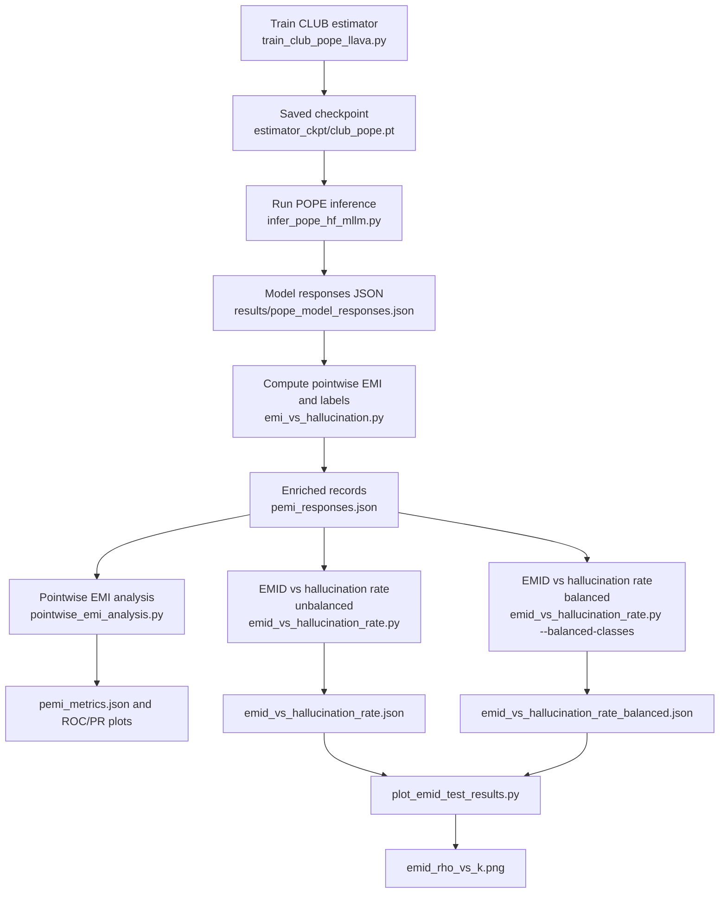

# Hallucination Detection Experiments: Reproducible Pipeline

This README documents the **exact execution order** for reproducing experiments in `hallucination_detection/`, the data/code flow between scripts, and expected outputs.

## 0) Setup

From repository root:

```bash
conda activate mllmshift-emi
```

## 1) Run Commands in Order

> Important CLI fixes from your command list:
> - `infer_pope_hf_mllm.py` expects `--model-id` (not `--model`).
> - `pointwise_emi_analysis.py` expects `--output-metrics-json` (not `--output-metrics`).

```bash
# 1) Train CLUB estimator checkpoint
python hallucination_detection/train_club_pope_llava.py \
  --output-ckpt estimator_ckpt/club_pope.pt

# 2) Run POPE inference with HF MLLM
python hallucination_detection/infer_pope_hf_mllm.py \
  --model-id llava-hf/llava-1.5-7b-hf \
  --output-json results/pope_model_responses.json

# 3) Compute pointwise EMI + hallucination labels from responses
python hallucination_detection/emi_vs_hallucination.py \
  --club-ckpt-path estimator_ckpt/club_pope.pt \
  --responses-json results/emi_vs_hallucination/old/pemi_responses.json \
  --output-records-json results/emi_vs_hallucination/old/pemi_responses.json

# 4) Analyze pointwise EMI detection quality
python hallucination_detection/pointwise_emi_analysis.py \
  --input-json results/emi_vs_hallucination/old/pemi_responses.json \
  --output-metrics-json results/emi_vs_hallucination/pemi_metrics.json

# 5) EMID vs hallucination rate (unbalanced)
python hallucination_detection/emid_vs_hallucination_rate.py \
  --input-json results/emi_vs_hallucination/old/pemi_responses.json \
  --id-json combined_dataset/llava_bench_coco_English.jsonl \
  --club-ckpt-path estimator_ckpt/club_pope.pt \
  --output-json results/emi_vs_hallucination/emid_vs_hallucination_rate.json

# 6) EMID vs hallucination rate (balanced)
python hallucination_detection/emid_vs_hallucination_rate.py \
  --input-json results/emi_vs_hallucination/old/pemi_responses.json \
  --id-json combined_dataset/llava_bench_coco_English.jsonl \
  --club-ckpt-path estimator_ckpt/club_pope.pt \
  --balanced-classes \
  --output-json results/emi_vs_hallucination/emid_vs_hallucination_rate_balanced.json

# 7) Plot K-vs-rho results (choose input from step 5 or 6)
python hallucination_detection/plot_emid_test_results.py \
  --input-json results/emi_vs_hallucination/emid_vs_hallucination_rate.json
```

## 2) Codeflow (What each script does)

1. **`train_club_pope_llava.py`**
   - Loads POPE + `llava_bench_coco_English` training data.
   - Builds CLIP/XLM-R embeddings and trains CLUB MI estimator.
   - Saves checkpoint (`.pt`) used by downstream EMI/EMID scripts.

2. **`infer_pope_hf_mllm.py`**
   - Runs selected multimodal model on POPE samples.
   - Produces response records with `question`, `reference_answer`, `model_answer`, etc.

3. **`emi_vs_hallucination.py`**
   - Encodes text, computes pointwise EMI using CLUB checkpoint.
   - Derives hallucination labels (`no -> yes` as positive class).
   - Writes enriched per-sample JSON used by analysis scripts.

4. **`pointwise_emi_analysis.py`**
   - Reads per-sample records.
   - Computes ROC-AUC, PR-AUC, robustness tests, and summary metrics.
   - Saves metrics JSON + PNG plots.

5. **`emid_vs_hallucination_rate.py`** (run twice: unbalanced and balanced)
   - Computes subset-level EMID-vs-hallucination-rate correlations over multiple `K` bins.
   - Uses two EMID variants: average pointwise EMI and EMI-class-based.
   - Writes result JSON consumed by plotting script.

6. **`plot_emid_test_results.py`**
   - Reads EMID test JSON.
   - Plots Spearman rho vs `K` with confidence intervals.

## 3) Artifact Handoff

- Step 1 output: `estimator_ckpt/club_pope.pt`
- Step 2 output: `results/pope_model_responses.json`
- Step 3 output/input for step 4/5/6:
  - `results/emi_vs_hallucination/old/pemi_responses.json`
- Step 4 output: `results/emi_vs_hallucination/pemi_metrics.json` (+ ROC/PR/distribution PNG files)
- Step 5 output: `results/emi_vs_hallucination/emid_vs_hallucination_rate.json`
- Step 6 output: `results/emi_vs_hallucination/emid_vs_hallucination_rate_balanced.json`
- Step 7 output: `results/emi_vs_hallucination/emid_rho_vs_k.png`

## 4) Flowchart



## 5) Notes for Stable Reproduction

- Run from repo root: `mllmshift-emi/`.
- Keep output paths as above to avoid accidental overwrite.
- The EMID script now supports chunked MI computation; on low-VRAM GPUs, set a smaller `--mi-chunk-size` (e.g., `32` or `16`) if needed.
